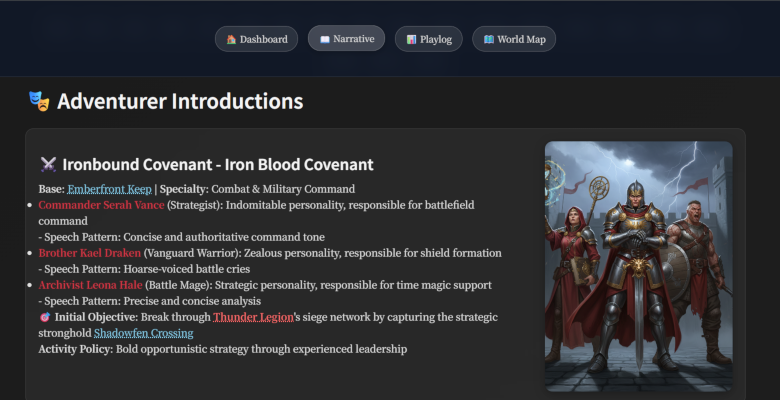

# Narrative Engine

[English | [日本語](README_ja.md)]

## 🎮 Project Overview

**A project where AI creates games and AI plays them, allowing humans to watch game replays without doing anything**

Narrative Engine is an AI-driven fully autonomous TRPG system. AI coding agents (Codex, Claude Code, etc.) function as both Game Master (GM) and players, executing and recording complete TRPG sessions without human intervention.

## 📖 Sample Replays

The following directories contain replays of TRPG sessions actually generated and executed by AI agents:

### Thunder Storm Campaign ([View](https://abagames.github.io/narrarive-engine/thunder_storm_campaign/))

- **Directory**: [`docs/thunder_storm_campaign/`](docs/thunder_storm_campaign/)
- **Content**: A fully autonomous TRPG session depicting adventures in a storm
- **Features**: Comprehensive campaign including weather systems, environmental changes, and party coordination tactics



### Triple Light Linked Ring ([View](https://abagames.github.io/narrarive-engine/triple_light_linked_ring/))

- **Directory**: [`docs/triple_light_linked_ring/`](docs/triple_light_linked_ring/)
- **Content**: A mystical adventure session revolving around three rings of light
- **Features**: Includes complex magic systems, puzzle elements, and character progression systems

### 🚀 Concept

- **AI-driven game generation and execution**: AI builds game systems and simultaneously plays those games
- **Digitization of paper-based tools**: Toolification of TRPG character sheets, dice, rulebooks, etc.
- **Prompt-driven rule system**: Uses documents in the `prompts/` directory as rulebooks
- **Fully autonomous execution**: Executes multi-turn sessions without human operation
- **Real-time spectating**: Humans can enjoy stories through generated narrative logs

## 🏗️ System Architecture

### Region Graph-Based Life Simulation

Narrative Engine implements a region graph-based life simulation engine with economic, social, and exploration mechanics:

- **Regional System**: Party activities in interconnected regions
- **Economic System**: Dynamic pricing, trading, resource management
- **Social System**: Guilds, alliances, competition, achievement systems
- **Exploration System**: Collaborative exploration, discovery, adventure management

### AI Agent Thinking Framework

#### GM Thinking Framework ([prompts/GM_CORE_MIND.md](prompts/GM_CORE_MIND.md))

- **Environmental Control**: NPC behavior, trap activation, weather changes
- **Battle Assessment**: Numerical combat analysis, tactical advantage determination
- **Narrative Direction**: Creating tension, dramatic presentation, pacing adjustment
- **Difficulty Adjustment**: Challenge levels according to player proficiency

#### Player Thinking Framework ([prompts/PLAYER_MIND.md](prompts/PLAYER_MIND.md))

- **Character Personality**: Distinctive thinking patterns for Fighter, Wizard, Rogue, etc.
- **Tactical Optimization**: Optimal action selection through numerical calculation
- **Cooperative Play**: Coordination tactics between party members
- **Risk Assessment**: Action risk-return analysis

### Specialized Systems

#### Combat System

- **Individual Combat** ([prompts/INDIVIDUAL_COMBAT_SYSTEM.md](prompts/INDIVIDUAL_COMBAT_SYSTEM.md)): Detailed sword and magic combat
- **Tactical Patterns** ([prompts/TACTICAL_PATTERNS.md](prompts/TACTICAL_PATTERNS.md)): Situation-specific optimal tactical selection
- **Dialogue System** ([prompts/DIALOGUE_SYSTEM.md](prompts/DIALOGUE_SYSTEM.md)): Combat dialogue according to character personalities

#### Social & Management Systems

- **Guild Management** ([prompts/GUILD_MANAGEMENT.md](prompts/GUILD_MANAGEMENT.md)): Guild operations, member management
- **Alliance Strategy** ([prompts/ALLIANCE_STRATEGY.md](prompts/ALLIANCE_STRATEGY.md)): Diplomacy with other parties
- **Quest Management** ([prompts/QUEST_MANAGEMENT.md](prompts/QUEST_MANAGEMENT.md)): Goal setting, progress management
- **Competitive Events** ([prompts/COMPETITIVE_EVENTS.md](prompts/COMPETITIVE_EVENTS.md)): Inter-party competition

#### Narrative Generation

- **Novel Conversion** ([prompts/PARTY_PERSPECTIVE_NOVEL_CONVERSION.md](prompts/PARTY_PERSPECTIVE_NOVEL_CONVERSION.md)): Converting play logs to readable stories
- **Character Personality** ([prompts/CHARACTER_PERSONALITY_TEMPLATES.md](prompts/CHARACTER_PERSONALITY_TEMPLATES.md)): Consistent personality expression

## 🔧 Technical Implementation

### File-Based Game State Recording

```
autonomous_sessions/
├── inputs/                      # AI Agent input files
│   ├── world_initial.json      # Initial world state
│   └── session_config.json     # Session configuration
├── sessions/                    # Session management
│   └── session_YYYYMMDD_HHMMSS/
│       ├── world_current.json  # Current world state
│       ├── playlog.jsonl       # Play log (action records)
│       └── narrative.md        # Generated story
└── ai_workspace/               # AI workspace
    ├── decision_requests/      # Decision request files
    ├── decision_responses/     # Decision response files
    └── world_snapshots/       # World state snapshots
```

### Main Tools

| Tool                                                     | Function                                     |
| -------------------------------------------------------- | -------------------------------------------- |
| [`start_session.ts`](src/start_session.ts)               | Session initialization, world state creation |
| [`process_ai_responses.ts`](src/process_ai_responses.ts) | Process AI decisions, update world state     |
| [`generate_next_turn.ts`](src/generate_next_turn.ts)     | Generate next turn, create decision requests |
| [`append_playlog.ts`](src/append_playlog.ts)             | Record play log, add narrative               |
| [`finalize_session.ts`](src/finalize_session.ts)         | Session completion processing                |

## 🎯 Execution Workflow

### Phase 1: Session Initialization

1. **Input file preparation**: AI creates initial world state and session configuration
2. **Session start**: Build session environment with `start_session.ts`
3. **Initial decision request**: Generate decision request file for the first turn

### Phase 2: Turn Execution Loop

1. **Framework loading**: Select and apply appropriate thinking framework
2. **Situation analysis**: Numerically evaluate current world state and party situation
3. **Action decision**: Select optimal actions according to framework
4. **Decision processing**: Process decisions with `process_ai_responses.ts`, update world state
5. **Narrative generation**: Record action results as story
6. **Next turn preparation**: Generate next decision request with `generate_next_turn.ts`

### Phase 3: Session Completion

1. **Final processing**: Complete session with `finalize_session.ts`
2. **Result output**: Output completed narrative and play log
