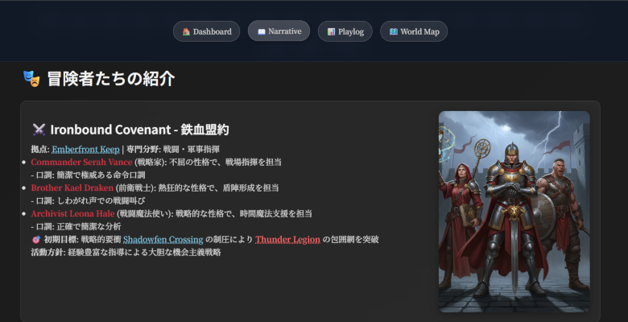

# Narrative Engine

[[English](README.md) | 日本語]

## 🎮 プロジェクト概要

**AI がゲームを作り、AI がプレイすることで、人間がなにもせずにそのゲームのリプレイを見ることができるプロジェクト**

Narrative Engine は、AI 駆動による完全自律型 TRPG システムである。AI コーディングエージェント（Codex, Claude Code 等）がゲームマスター（GM）とプレイヤーの両方として機能し、人間の介入なしに完全な TRPG セッションを実行・記録する。

## 📖 サンプルリプレイ

以下は、実際に AI エージェントが生成・実行した TRPG セッションのリプレイである：

### Thunder Storm Campaign (雷嵐キャンペーン) ([閲覧](https://abagames.github.io/narrative-engine/thunder_storm_campaign_ja/))

- **ディレクトリ**: [`docs/thunder_storm_campaign_ja/`](docs/thunder_storm_campaign_ja/)
- **内容**: 嵐の中での冒険を描いた完全自律 TRPG セッション
- **特徴**: 天候システム、環境変化、パーティー連携戦術を含む総合的なキャンペーン



### Eiroku Mist Chronicles (永禄霧記) ([閲覧](https://abagames.github.io/narrative-engine/eiroku_mist_chronicles_ja/))

- **ディレクトリ**: [`docs/eiroku_mist_chronicles_ja/`](docs/eiroku_mist_chronicles_ja/)
- **内容**: 永禄期の混乱を背景に、霧に包まれた諸国で四勢力が暗闘を繰り広げるキャンペーン
- **特徴**: 忍術による諜報戦、陰陽道結界戦、諸派の技術競争といった多勢力同時進行型の駆け引きを描写

### Triple Light Linked Ring (三光連環) ([閲覧](https://abagames.github.io/narrative-engine/triple_light_linked_ring_ja/))

- **ディレクトリ**: [`docs/triple_light_linked_ring_ja/`](docs/triple_light_linked_ring_ja/)
- **内容**: 三つの光の指輪を巡る神秘的な冒険セッション
- **特徴**: 複雑な魔法システム、謎解き要素、キャラクター成長システムを含む

### 🚀 コンセプト

- **AI 主導のゲーム生成・実行**: AI がゲームシステムを構築し、同時にそのゲームをプレイ
- **紙ベースツールのデジタル化**: TRPG のキャラクターシート、ダイス、ルールブック等をツール化
- **プロンプト駆動ルールシステム**: `prompts/`ディレクトリ内の文書をルールブックとして使用
- **完全自律実行**: 人間の操作なしに複数ターンのセッションを実行
- **リアルタイム観戦**: 生成されたナラティブログを通じて人間が物語を観賞

## 🏗️ システム構成

### 依頼を軸にした世界シミュレーション

パーティーは地域グラフ上でギルドの依頼をめぐって競い、協力する。キャラクターが何を試みるかはAIエージェントが決め、何が起きるかはエンジンが決める。

- **依頼掲示板**: 先着を争う依頼、貢献度で報酬を分ける共同依頼、両立しない衝突依頼、真意を隠す依頼主
- **エンジンによる判定**: 不確かな試みはcheckとして宣言し、成功・部分成功・失敗の効果をシード付き2d6ロールの前に書く。出し直しても振り直しにはならない
- **権限と不変条件**: パーティーは自分の状態しか変えられない。競合相手への損害には対抗checkが必要。依頼の進捗はcheckからのみ生じる。応答は全か無かで適用される
- **世界の圧力**: 期限は切れ、進行クロックは進んで発動し、失敗した依頼は事態を悪化させる。帰結は覆らない
- **不平等な情報**: パーティーに見えるのは公開された掲示板、競合相手の大まかな進捗、自分の（誤りもありうる）知識だけである。GMはすべてを見る
- **シーズンと順位**: 依頼で得た評判により、シーズン終了時の昇格者が決まる
- **ドラフト**: シーズン開始時と中盤に、ヒーローが専属依頼・冒険者・唯一のアイテム・情報・誘いをスネーク順に指名する。指名は公開され互いへの反応となり、順番は貸しで買える
- **地域・社会システム**: 地域グラフに沿った移動、関係値、貸し借り、失敗を覚えている依頼主NPC。市場は任意の背景

### AI エージェント思考フレームワーク

#### GM 思考フレームワーク ([prompts_ja/GM_CORE_MIND.md](prompts_ja/GM_CORE_MIND.md))

- **環境制御**: NPC 行動、罠発動、天候変化
- **戦況評価**: 数値的戦力分析、戦術優位性判定
- **物語演出**: 緊張感創出、ドラマ演出、ペース調整
- **難易度調整**: プレイヤーの習熟度に応じた挑戦レベル

#### プレイヤー思考フレームワーク ([prompts_ja/PLAYER_MIND.md](prompts_ja/PLAYER_MIND.md))

- **キャラクター個性**: Fighter、Wizard、Rogue 等の個性的思考パターン
- **戦術的最適化**: 数値計算による最適行動選択
- **協調プレイ**: パーティーメンバー間の連携戦術
- **リスク評価**: 行動リスク・リターン分析

### 専門システム

#### 戦闘システム

- **個人戦闘** ([prompts_ja/INDIVIDUAL_COMBAT_SYSTEM.md](prompts_ja/INDIVIDUAL_COMBAT_SYSTEM.md)): 詳細な剣と魔法の戦闘
- **戦術パターン** ([prompts_ja/TACTICAL_PATTERNS.md](prompts_ja/TACTICAL_PATTERNS.md)): 状況別最適戦術選択
- **対話システム** ([prompts_ja/DIALOGUE_SYSTEM.md](prompts_ja/DIALOGUE_SYSTEM.md)): キャラクター個性に応じた戦闘台詞

#### 社会・管理システム

- **ギルド管理** ([prompts_ja/GUILD_MANAGEMENT.md](prompts_ja/GUILD_MANAGEMENT.md)): ギルド運営、メンバー管理
- **同盟戦略** ([prompts_ja/ALLIANCE_STRATEGY.md](prompts_ja/ALLIANCE_STRATEGY.md)): 他パーティーとの外交
- **クエスト管理** ([prompts_ja/QUEST_MANAGEMENT.md](prompts_ja/QUEST_MANAGEMENT.md)): ワールドのデータモデル、check、権限、依頼のライフサイクル、停止条件
- **競争イベント** ([prompts_ja/COMPETITIVE_EVENTS.md](prompts_ja/COMPETITIVE_EVENTS.md)): パーティー間競争

#### ナラティブ生成

- **小説変換** ([prompts_ja/PARTY_PERSPECTIVE_NOVEL_CONVERSION.md](prompts_ja/PARTY_PERSPECTIVE_NOVEL_CONVERSION.md)): プレイログから読みやすい物語への変換
- **キャラクター性格** ([prompts_ja/CHARACTER_PERSONALITY_TEMPLATES.md](prompts_ja/CHARACTER_PERSONALITY_TEMPLATES.md)): 一貫した個性表現

## 🔧 技術実装

### ファイルベースのゲーム状態記録

```
autonomous_sessions/
├── inputs/                      # AI Agent 入力ファイル
│   ├── world_initial.json      # 初期世界状態
│   └── session_config.json     # セッション設定
├── sessions/                    # セッション管理
│   └── session_YYYYMMDD_HHMMSS/
│       ├── world_current.json  # 現在の世界状態
│       ├── playlog.jsonl       # プレイログ（行動記録）
│       └── narrative.md        # 生成された物語
└── ai_workspace/               # AI作業領域
    ├── decision_requests/      # 決定要求ファイル
    ├── decision_responses/     # 決定応答ファイル
    └── world_snapshots/       # 世界状態スナップショット
```

### 主要ツール

| ツール                                                   | 機能                           |
| -------------------------------------------------------- | ------------------------------ |
| [`start_session.ts`](src/start_session.ts)               | セッション初期化、世界状態作成 |
| [`process_ai_responses.ts`](src/process_ai_responses.ts) | 権限検証、check のロール、世界状態更新、依頼の解決 |
| [`generate_next_turn.ts`](src/generate_next_turn.ts)     | 次ターン生成、決定要求作成     |
| [`append_playlog.ts`](src/append_playlog.ts)             | プレイログ記録、ナラティブ追加 |
| [`finalize_session.ts`](src/finalize_session.ts)         | セッション完了処理、シーズン順位 |
| [`world_rules.ts`](src/world_rules.ts)                   | ツールが使うエンジン規則: ダイス、権限、不変条件、依頼、クロック |
| [`draft.ts`](src/draft.ts)                               | ドラフト規則: 順番、貸しによる入れ替え、指名、誘い、売れ残り |
| [`turn_context.ts`](src/turn_context.ts)                 | 決定要求のコンテキスト（パーティーには公開掲示板、GMには全体） |

## 🎯 実行ワークフロー

### Phase 1: セッション初期化

1. **入力ファイル準備**: AI が初期世界状態・セッション設定を作成
2. **セッション開始**: `start_session.ts`でセッション環境を構築
3. **初期決定要求**: 最初のターンの決定要求ファイルを生成

### Phase 2: ターン実行ループ

1. **フレームワーク読み込み**: 適切な思考フレームワークを選択・適用
2. **状況分析**: 現在の世界状態・パーティー状況を数値的に評価
3. **行動決定**: フレームワークに従って最適行動を選択
4. **決定処理**: `process_ai_responses.ts`で決定を処理、世界状態を更新
5. **ナラティブ生成**: 行動結果を物語として記録
6. **次ターン準備**: `generate_next_turn.ts`で次の決定要求を生成

### Phase 3: セッション完了

1. **最終処理**: `finalize_session.ts`でセッションを完了
2. **結果出力**: 完成したナラティブとプレイログを出力
